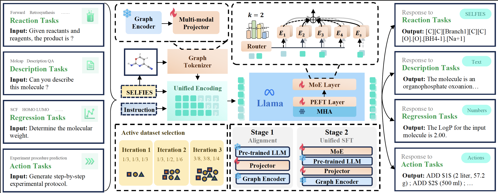

# [Omni-Mol: Exploring Universal Convergent Space for Omni-Molecular Tasks](https://arxiv.org/abs/2502.01074)

Code release for paper *Omni-Mol: Exploring Universal Convergent Space for Omni-Molecular Tasks*


## Overview


Building generalist models has recently demonstrated remarkable capabilities in diverse scientific domains. Within the realm of molecular learning, several studies have explored unifying diverse tasks across diverse domains. However, negative conflicts and interference between molecules and knowledge from different domain may have a worse impact in threefold. First, conflicting molecular representations can lead to optimization difficulties for the models. Second, mixing and scaling up training data across diverse tasks is inherently challenging. Third, the computational cost of refined pretraining is prohibitively high. To address these limitations, we present Omni-Mol, a scalable and unified LLM-based framework for direct instruction tuning Omni-Mol builds on three key components to tackles conflicts: (1) a unified encoding mechanism for any task input; (2) an active-learning driven data selection strategy that significantly reduces dataset size; (3) a novel design of the adaptive gradient stabilization module and anchor-and-reconcile MoE framework that ensures stable convergence. Experimentally, Omni-Mol achieves state-of-the-art performance across 15 molecular tasks, demonstrates the presence of scaling laws in the molecular domain, and is supported by extensive ablation studies and analyses validating the effectiveness of its design.

## Release
[2025/2/8] 🔥 We release our first version of code

## Install
1. Clone the repository and `cd` to the folder
2. Environment Settings:
   1. CUDA=12.4
   2. Pytorch=2.4.1
   3. Ubuntu=22.04
3. Install package through 
```
conda create -n omnimol python=3.10
conda activate omnimol
pip install -r requirements.txt
pip install flash-attn --no-binary flash-attn
```
3. Download the base model
```
python model_download.py
``` 

## Weights
Ongoing

## Dataset
### Task list
- "forward"
- "reagent"
- "retrosynthesis"
-  "homolumo"
- "molcap"
- "solvent"
- "catalyst"
- "yield_BH"
- "yield_SM"
- "dqa"
- "scf"
- "logp"
- "weight"
- "tpsa"
- "complexity"
- "experiment"

[Data_link](MillenniumHL/omnimol)
```bash

```


## Train
### Stage 1 Training of Projector
```bash
bash scripts/pretrain.sh
```
Please refer to `args.py` for detailed parameter explanation.

### Stage 2 MoE + PEFT
```bash 
bash scripts/moe/llama3.2-1b/mixtrain-moelora.sh
```

## Evaluation
Basic evaluation
```bash
bash scripts/eval.sh
```

If you have multiple GPUs, we support distributed inference
```bash
bash scripts/dist_eval.sh
```

## Code Base
We believe a clean, readable and well-commented code can benefit the community, the design of this code base follows this rule, where we provide detailed annotations and simple/efficient code implementation.

The original code base follows LLaVA(https://github.com/haotian-liu/LLaVA.git) and InstructMol(https://github.com/IDEA-XL/InstructMol.git). But we optimized a lot and achieved better efficiency(less VRAM and faster training speed).

## Citation
```bibtex
@misc{hu2025omnimol,
      title={Omni-Mol: Exploring Universal Convergent Space for Omni-Molecular Tasks}, 
      author={Chengxin Hu and Hao Li and Yihe Yuan and Zezheng Song and Haixin Wang},
      year={2025},
      eprint={2502.01074},
      archivePrefix={arXiv},
      primaryClass={cs.LG},
      url={https://arxiv.org/abs/2502.01074}, 
}
```
